# 📄 Streamlit PDF Chatbot (RAG-based)

A local PDF chatbot that lets you upload a PDF file and ask questions about it using OpenAI’s GPT models + a FAISS-powered vector database.

---

## 🛠️ Setup Guide

### 1. Clone the repository

```bash
git clone https://github.com/yourusername/pdf-rag-chatbot.git
cd pdf-rag-chatbot
```

### 2. Set up a virtual environment (optional but recommended)

```bash
python -m venv venv
source venv/bin/activate  # or venv\Scripts\activate on Windows
```

### 3. Install dependencies

```bash
pip install -r requirements.txt
```

### 4. Add your OpenAI API key

Create a `.env` file in the root directory:

```
OPENAI_API_KEY=your-openai-api-key-here
```

### 5. Run the app

```bash
streamlit run app.py
```

---

## 📘 Introduction & How It Works

This app uses Retrieval-Augmented Generation (RAG) to answer your questions from a PDF. It follows these steps:

1. Upload a PDF
2. Extract and split the text into chunks
3. Generate vector embeddings for each chunk
4. Store chunks in a FAISS vector database
5. When a question is asked, perform similarity search
6. Send relevant chunks as context to OpenAI GPT to generate an answer

---

## 🔧 Logic Breakdown

### 1. PDF Reading

- Uses `PyPDF2` to read and extract text from each page.
- Handles basic error checking for empty PDFs.

### 2. Chunking

- `RecursiveCharacterTextSplitter` splits long text into overlapping chunks.
- Parameters used:
  - `chunk_size=500`
  - `chunk_overlap=50`

### 3. Embeddings & Vector DB

- Uses `OpenAIEmbeddings` to generate vector representations of each chunk.
- Stores them in-memory using `FAISS` for fast similarity search.

### 4. RAG with LangChain

- A `RetrievalQA` chain is created using:
  - `ChatOpenAI` for LLM
  - `FAISS` retriever for context
- This enables accurate answers grounded in the uploaded document.

---

## 🧠 Mermaid Flowchart

```mermaid
flowchart TD
    A[📄 Upload PDF] --> B[🧾 Extract Text]
    B --> C[✂️ Split into Chunks]
    C --> D[🔡 Embed using OpenAI]
    D --> E[🧠 Store in FAISS Vector DB]
    F[💬 User Question] --> G[🔍 Similarity Search]
    G --> H[🧠 GPT with Context]
    H --> I[🤖 Display Answer]
    E --> G
```



---

## ⚠️ Weaknesses and Future Improvements

| Area            | Limitation             | Future Enhancement                              |
| --------------- | ---------------------- | ----------------------------------------------- |
| 🖼️ Scanned PDFs | No OCR support         | Integrate Tesseract OCR                         |
| 💾 Persistence  | FAISS not saved        | Add disk-based FAISS caching                    |
| 📚 Multi-PDF    | Only 1 PDF per session | Enable multi-document RAG                       |
| 💬 Chat History | One-shot Q&A           | Add chat memory or history                      |
| 🧠 LLM Choice   | Only OpenAI            | Add support for local LLMs (Ollama, LM Studio)  |
| 🚀 Deployment   | Local only             | Deploy to Streamlit Cloud or HuggingFace Spaces |

---

## 📁 Project Structure

```
pdf-rag-chatbot/
├── app.py               # Streamlit app code
├── requirements.txt     # Python dependencies
├── .env                 # Your API key (not committed to git)
└── README.md            # Project documentation
```

---

## 📃 License

MIT License © 2025 Your Name

---

## 🤝 Contributions Welcome

Open to pull requests, ideas, and improvements. Let's make document-based LLMs more accessible!
